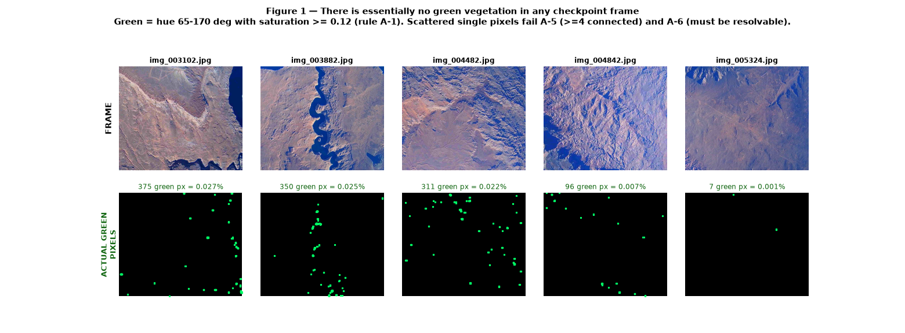
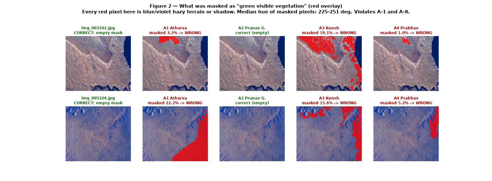
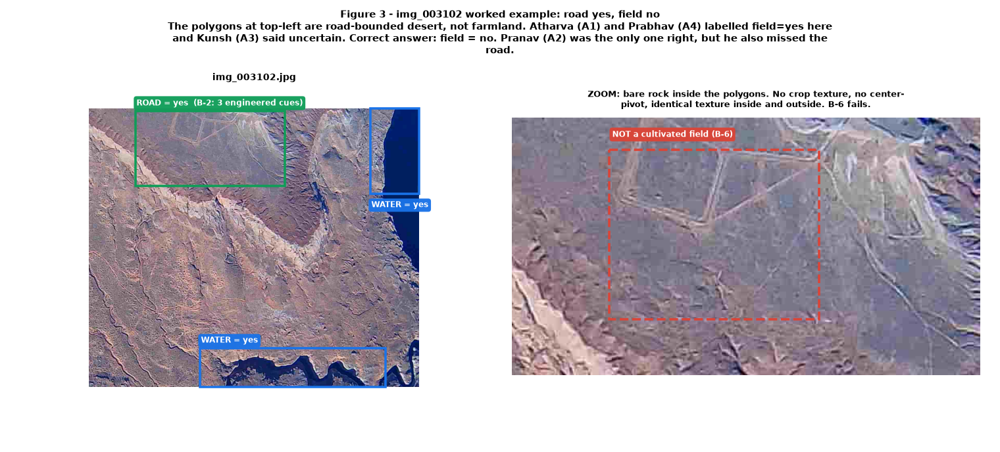
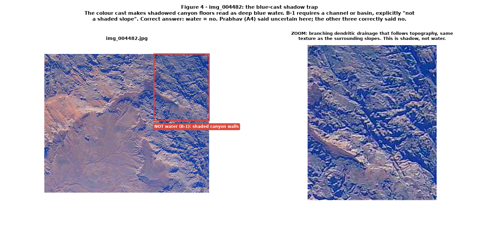
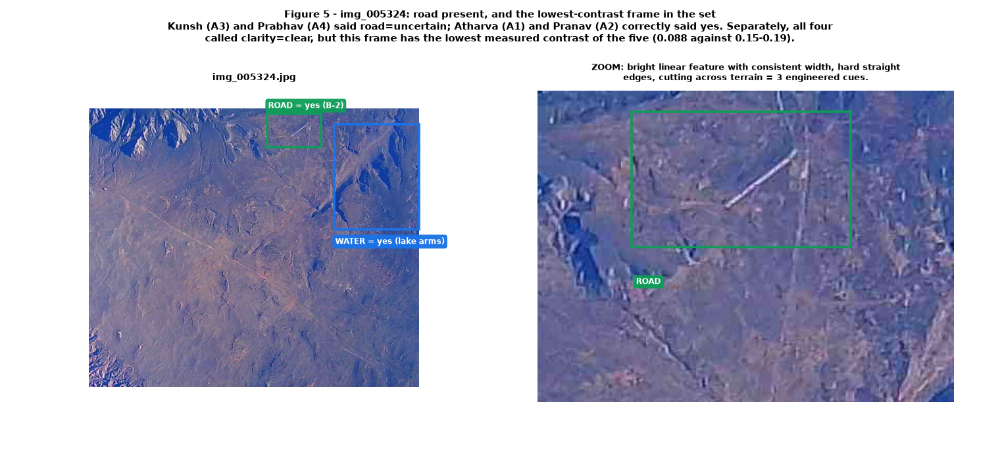

# Calibration Checkpoint 5 — Review, Answer Key, and Retraining

**Read this completely before you label image 6.** All four annotators submitted checkpoint 5 on
time and in the correct format. Nobody is in trouble. But the review found one problem that affects
everyone and several rule misreadings that are easy to fix, so calibration is paused until we have
all worked through this page together.

This document is the authority for the five checkpoint frames. Where it conflicts with your memory
of the meeting, this page wins. Every new rule here is numbered so it can be cited during
adjudication, exactly like the rules in the annotation manual.

| | |
|---|---|
| Frames covered | `img_003102`, `img_003882`, `img_004482`, `img_004842`, `img_005324` |
| Submitted by | Atharva (A1), Pranav G. (A2), Kunsh (A3), Prabhav (A4) |
| Status | Calibration **paused**. Do not label image 6 until the lead says `CONTINUE`. |

---

## Part 1 — The big one: there is no green vegetation in these frames

The camera has a strong blue/violet colour cast. The whole scene is shifted toward blue, so hazy
terrain, shadowed slopes, and dark rock all *look* like they could be dark vegetation. They are not.

Measuring the actual pixels, using rule **A-1**'s definition of green (hue 65–170°, saturation ≥ 0.12):

| Frame | Pixels that are actually green | Share of frame |
|---|---:|---:|
| `img_003102` | 375 | 0.027% |
| `img_003882` | 350 | 0.025% |
| `img_004482` | 311 | 0.022% |
| `img_004842` | 96 | 0.007% |
| `img_005324` | 7 | 0.0005% |

Those few pixels are scattered single dots spread across the whole frame — the bottom row of
Figure 1. They fail **A-5** (a region needs ≥ 4 connected pixels) and **A-6** (only resolvable
patches are masked; diffuse tint is not).

> ### The correct vegetation mask for all five checkpoint frames is **empty**.

This is not a trick and it is not a trap. It is what the rules produce on this footage. An empty
mask is a valid, complete answer, and the mask export archive will be nearly empty — that is
expected and correct.

---

## Part 2 — What actually got masked

Red shows the pixels each person marked as `green_visible_vegetation`.

| Person | `img_003102` | `img_005324` | Median hue of masked pixels |
|---|---:|---:|---|
| Atharva (A1) | 3.2% | 22.2% | 230–251° (blue) |
| Pranav G. (A2) | 0% | 0% | — (correctly empty) |
| Kunsh (A3) | 19.1% | 15.6% | 226–251° (blue) |
| Prabhav (A4) | 1.0% | 5.2% | 225–230° (blue) |

Across every masked region from all three, **0.00%** of the masked pixels fell in the green hue
band. The mean colour of the masked pixels is something like RGB (81, 92, 144) — a blue-grey slate.
Blue is the dominant channel in every case.

Two specific things to notice in Figure 2:

- In `img_003102`, Kunsh's mask runs along the **lake shoreline and into the water itself**. Rule
  **A-8** excludes water from the mask without exception.
- In `img_005324`, Atharva's mask covers a large block of open hazy plateau. There is no distinct
  patch boundary there — this is exactly the "diffuse tint" that **A-6** says not to mask.

**Pairwise mask agreement was 0.15 Dice against a target of 0.75.** That number is not a reflection
of anyone's care or effort; three people applied the same wrong interpretation, which is a
documentation failure, not an annotator failure.

---

## Part 3 — Complete answer key for the five frames

### Task A — vegetation masks

Empty for all five frames. No brush regions. `uncertain_region` = `none` unless you saw a specific
green-looking region you excluded under A-3, in which case set it to `present` and log the frame.

### Task B — feature presence

| Frame | water | road | building | forest | snow | field |
|---|---|---|---|---|---|---|
| `img_003102` | **yes** | **yes** | no | no | no | **no** |
| `img_003882` | **yes** | no | no | no | no | **no** |
| `img_004482` | **no** | no | no | no | no | no |
| `img_004842` | **yes** | no | no | no | no | **no** |
| `img_005324` | **yes** | **yes** | no | no | no | **no** |

### Task E — quality flags

| Frame | cloud | clarity | balloon | sharpness | exposure | glare |
|---|---|---|---|---|---|---|
| `img_003102` | none | clear | none | sharp | ok | none |
| `img_003882` | none | clear | none | sharp | ok | none |
| `img_004482` | none | clear | none | sharp | ok | none |
| `img_004842` | none | clear | none | sharp | ok | none |
| `img_005324` | none | **moderate** | none | sharp | ok | none |

Exposure is `ok` on all five and this is measured, not opinion. The manual's threshold for `over` is
clipped highlights on **more than 10%** of the frame. The worst frame of the five clips 4.2% of
pixels, and no frame crushes more than 0.06% of shadows. Nothing here is over- or under-exposed.

---

## Part 4 — Worked examples

### 4.1 Road-bounded desert is not a cultivated field

The polygons at the top-left of `img_003102` are graded tracks enclosing bare desert. Zoom in and the
ground inside a polygon has exactly the same rock texture as the ground outside it. There is no crop
colour, no plough pattern, no centre-pivot circle.

- **Road = yes.** Consistent width along its length, hard straight edges, visible junctions. That is
  3 engineered cues; **B-2** needs 2.
- **Field = no.** **B-6** requires geometric *agricultural* parcels. A road network that happens to
  enclose an area is not a field.
- This is also **B-8** in action: do not infer one feature from another. A road being present is not
  evidence of farmland.

### 4.2 The blue-cast shadow trap

This is the single most important new confuser on this dataset, and it is the water-flag equivalent
of the road-versus-wash test.

Because everything is shifted blue, shadowed canyon floors read as deep blue water. Tell them apart
by **shape**, never by colour:

| Shadow (not water) | Water |
|---|---|
| Branching, dendritic, tree-like | Smooth continuous body, or one channel |
| Follows the topography, narrows uphill | Sits in a basin, has a level shoreline |
| Same rough texture as the slope beside it | Smooth, sometimes with a specular sheen |
| Hugs one side of a ridge | Fills the low point symmetrically |

**B-1** already says water must be on a channel or a basin, "not a shaded slope". On this footage that
clause is doing most of the work.

For contrast, `img_004842` and `img_003102` contain real water — large, smooth, basin-filling
lobes of Lake Powell with clear shorelines. Those are unambiguous `yes`.

### 4.3 Road present, and the contrast trap

The bright linear feature in `img_005324` has consistent width, hard straight edges, and cuts across
the terrain rather than following a drainage. Three cues. **Road = yes.**

All four annotators marked this frame `clarity = clear`. It is in fact the *least* clear frame of
the five. The blue veiling is heaviest here and the measured contrast is the lowest in the set.

---

## Part 5 — New rules, effective immediately

These are additions to the decision log. Cite them by number.

**A-11 — Blue cast does not create vegetation.**
On this flight the imagery has a global blue/violet cast. A region only qualifies under A-1 if it
reads green *relative to the frame it sits in*. If a region's blue channel is visibly the strongest,
it is not vegetation, regardless of how dark or "vegetated" it looks. When in doubt, compare the
candidate region against a patch of open plateau in the same frame — if they differ only in
brightness and not in hue, it is terrain.

**A-12 — An empty mask is a complete answer.**
Do not go looking for something to mask. Most frames on this flight will have no vegetation at all.
Submitting a frame with zero brush regions is normal and correct; the exported archive being small
or empty is not an error.

**B-9 — Shadow versus water on blue-cast imagery.**
Use the shape test in section 4.2. Colour alone is never sufficient evidence for `water = yes` on
this dataset. A branching pattern that follows topography is `no`, not `uncertain`.

**B-10 — Road networks enclosing bare ground are not fields.**
`field = yes` requires visible agricultural surface — crop colour, tillage texture, or a
centre-pivot circle. Enclosure by tracks is not enough.

**E-2 — Clarity is judged against this flight, not against a clean aerial photo.**
Every frame on this flight is hazy compared with normal satellite imagery. `clear` means clear *for
this dataset*: ground texture and small drainages are crisp. Use `moderate` when the veiling is
heavy enough that fine texture flattens out and the scene loses local contrast, as in `img_005324`.
Reserve `heavy` for frames where you genuinely cannot identify features.

**E-3 — `cloud` means discrete cloud, not the global haze.**
The whole flight sits under a uniform atmospheric veil. That belongs in `clarity`, not `cloud`. Set
`cloud` above `none` only when you can see actual cloud or a distinct obscuring bank over part of
the ground. All four annotators already labelled this correctly; this rule just makes it explicit so
it stays consistent.

---

## Part 6 — Individual results

Scores are a strict match against the Part 3 key, out of 30 presence answers and 30 quality answers.

An `uncertain` that should have been a definite `yes`/`no` counts as a miss here, but it is **not a
rule violation** — B-0 explicitly permits `uncertain`. It just carries less information, so the
lower-information answers are listed separately below.

| Person | Presence | Quality | Total | Masks |
|---|---:|---:|---:|---|
| Kunsh (A3) | 28/30 | 27/30 | **55/60** | 3 of 5 wrong |
| Pranav G. (A2) | 26/30 | 27/30 | **53/60** | **5 of 5 correct** |
| Prabhav (A4) | 22/30 | 25/30 | **47/60** | 3 of 5 wrong, plus 19 extra frames |
| Atharva (A1) | 23/30 | 21/30 | **44/60** | 4 of 5 wrong |

### Atharva (A1)

Strongest instinct on roads — you were one of only two people to catch the `img_005324` road. The
issues are a consistent tendency to over-call:

- `field = yes` on four of five frames. Correct answer is `no` on all five. See 4.1 and new rule B-10.
- `building = yes` on `img_003882` and `img_004842`; no other annotator saw a structure and none is
  visible. **B-3** needs regular man-made geometry — straight edges, right angles, a roof.
- `exposure = over` on three frames. Measured clipping never exceeds 4.2% against a 10% threshold.
  Please treat the numeric thresholds in Task E as hard rules, not impressions.
- `glare = present` on two frames, alone in doing so.
- Largest mask over-call in the group: 22.2% of `img_005324`.
- `water = uncertain` on `img_005324`, where large lake arms are clearly visible.

**To fix:** re-export your mask archive as **PNG**. Your submission contained only `.npy` files.
Manual rule **T-3** requires single-channel 8-bit PNG. On the Label Studio export screen choose
*Brush labels to NumPy and PNG* and confirm the archive contains `.png` files before uploading.

### Pranav G. (A2)

**The only person who got the masks right** — all five correctly empty. Your 22-byte export archive
was flagged during review and then cleared: an empty archive is the correct output when there are no
brush regions. Nothing to redo there.

The concern is the opposite of Atharva's — under-calling:

- `water = no` on `img_004842` and `img_005324`, where large smooth lake basins are plainly visible.
  These are not close calls.
- `road = no` on `img_003102`, which has three engineered cues.
- `building = yes` on `img_005324` — your one over-call, and no other annotator agreed.
- 26 of your 30 presence answers were `no`, and you used `uncertain` zero times.

Three of your five mask frames were completed in under 30 seconds. **G-2** requires panning the
whole frame at 100% zoom. Your answers were right, but please make sure that is because you looked
and found nothing, not because the frame was scanned at a glance — on production frames that do
contain vegetation, the same approach will miss it.

### Kunsh (A3)

Best categorical scores in the group, and the only person to get every `exposure` call right. Water
calls were all correct. Your use of `uncertain` on `img_003102` field was reasonable given the
ambiguity — new rule B-10 now settles it as `no`.

- Largest single mask error in the group: 19.1% of `img_003102`. Part of that mask crosses the
  shoreline into the lake, which **A-8** forbids outright.
- `road = uncertain` on `img_005324`; the three cues in Figure 5 support a definite `yes`.

**To fix:** masks only. Your file handling, formats, and categorical work were clean throughout.

### Prabhav (A4)

Most disciplined use of `uncertain` — five times, always in genuinely ambiguous places. That is
correct behaviour under **B-0** and **G-3**, and it is not counted against you as a rule violation.

- **Protocol:** you completed **24 of 30** mask tasks instead of stopping at 5. The guide (Part 12,
  step 4) says stop at exactly `5 of 30` and wait for `CONTINUE`. Because those 19 extra frames were
  labelled under the pre-review interpretation, they all need redoing. Presence and quality correctly
  stopped at 5.
- You have 1 unsubmitted draft in the mask project and 2 in the quality project. Submit or discard
  them so the counts are unambiguous.
- `forest = yes` on `img_005324`. **B-4** needs continuous tree canopy larger than a grid cell, and
  this frame has no green at all.
- `field = yes` on `img_003102` and `img_004842`; see B-10.
- `exposure = under` on two frames; measured shadow-crush is 0.000%.
- `water = uncertain` on `img_004842`, where the basin is large and unambiguous.

---

## Part 7 — What happens now

1. Read this page in full, including the figures.
2. Attend the re-alignment meeting. Bring any case you disagree with; disagreements get logged and
   become numbered rules.
3. **Atharva** re-exports the checkpoint mask archive as PNG.
4. **Prabhav** submits or discards his open drafts and stands by — his 19 extra mask frames will be
   redone after the meeting.
5. Everyone re-does the five checkpoint mask tasks under rules A-11 and A-12. Presence and quality do
   not need re-doing; the corrections in Part 6 will be applied at adjudication.
6. Wait for the lead to send `CONTINUE` before touching image 6.

Do not compare your submissions with each other outside the meeting. Independence is what makes the
agreement statistics meaningful.

---

## A note on why this happened

Three of four annotators, and the gold reference set as well, converged on the same wrong reading of
rule A-1. When almost everyone makes the same mistake, the instructions are at fault, not the people.
The original manual was written before anyone had seen how strong the colour cast on this footage is,
and it never said what to do when an entire flight is shifted toward blue. Rules A-11, A-12, B-9,
B-10, E-2, and E-3 exist to close that gap.
