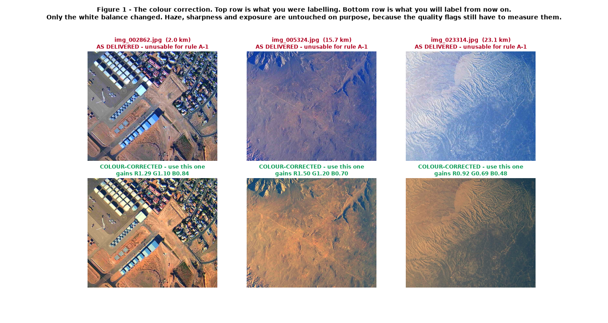
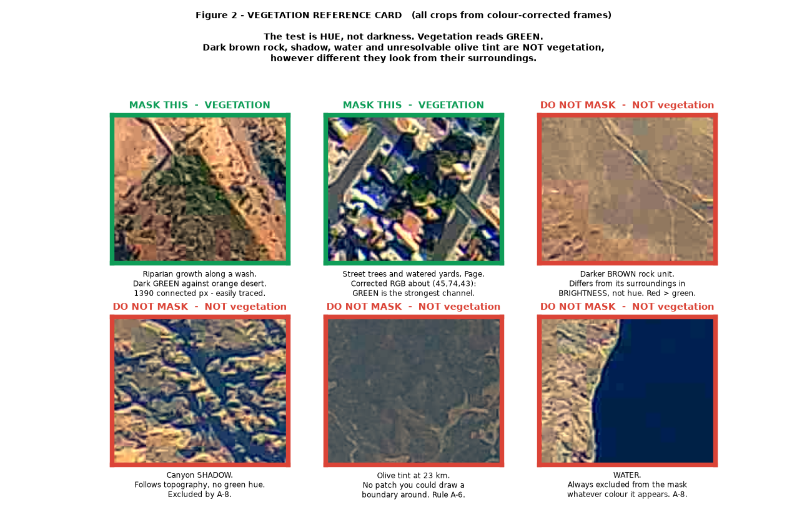

# Checkpoint 5 Review — corrected frames, new vegetation rules, answer key

**Revision 2, supersedes everything published before it.** Revision 1 of this
page contained a wrong vegetation answer key. It has been replaced. If you read
the earlier version, discard what it said about masks; everything it said about
presence and quality still holds.

Read this completely before you label anything else.

---

## Part 0 — What changed, in one table

| | Revision 1 (wrong) | Revision 2 (this page) |
|---|---|---|
| Which images you label | `frames/` | **`frames_corrected/`** — colour-corrected |
| Correct mask on the 5 checkpoint frames | "empty" | **small but real**, 0.03–0.38% of the frame |
| Rules A-11, A-12 | introduced | **withdrawn** |
| New vegetation rules | — | **A-13 … A-17** below |
| Presence / quality findings | — | **unchanged, still stand** |

### Why revision 1 was wrong

The original review measured greenness on the raw frames. The camera recorded
with an uncorrected white balance, so the whole scene is pushed toward blue and
real vegetation reads grey-olive. Measuring "is it green" on imagery in that
state answers the wrong question. Corrected, these frames do contain vegetation.

Anyone who masked areas that looked different from their surroundings was
responding to something real. The task was not answerable on the images you were
given, and that is not on you.

---

## Part 1 — You now label colour-corrected images



Every Label Studio task file now points at `frames_corrected/`. You do not have
to download anything or change any setting — when you recreate your projects the
new images load automatically.

**What the correction does:** removes the blue/violet colour cast, by scaling
each frame's colour channels so that its bare terrain matches properly balanced
USGS NAIP satellite imagery of the same ground.

**What the correction does NOT do:** it does not remove haze. This is
deliberate and it matters for your quality labels.

### Haze — read this carefully, it is two different things

Haze does two separate things to these images, and only one of them has been
fixed.

| | What it is | Fixed? | Which of your labels it affects |
|---|---|---|---|
| **Colour cast** | Everything shifted toward blue/violet | **Yes, removed** | Vegetation masks. This is what broke them. |
| **Veiling / contrast loss** | A white haze layer washing out local contrast | **No, left in place** | `clarity`. It still has to be judged. |

The colour cast was an artefact of the camera. The veiling is real atmosphere
between the balloon and the ground, and it genuinely limits what can be seen —
so it stays in the imagery and you keep labelling it.

**The one thing to remember:** haze can *hide* vegetation, but haze can never
*create* vegetation. If a hazy frame shows no green, the correct answer is that
there is no visible vegetation — not that there is vegetation you cannot quite
see. Mark `clarity` accordingly and move on.

---

## Part 2 — What is and is not vegetation



Print this figure or keep it open in a second window while you work.

### The single test

> **A region is vegetation only if GREEN is its strongest colour channel.**
> Not "darker than its surroundings". Not "greyer". Not "different". Green.

On the corrected frames, real vegetation here looks like a lawn or a tree
looks — a definite green, usually dark, typically RGB near (45–75, 70–100,
45–75). Bare desert is orange-brown, with red clearly the strongest channel.

### The four things that are NOT vegetation

These are the four traps. Three of the four annotators fell into at least one.

1. **Darker brown rock.** Different rock units differ in brightness. A darker
   patch of ground is still rock if red beats green. This is the single most
   common error in checkpoint 5.
2. **Shadow.** Canyon shadows are dark and, before correction, looked blue.
   They follow topography and branch like a tree. Never vegetation. (A-8)
3. **Water.** Excluded always, whatever colour it appears — including the
   turquoise ponds near Page. (A-8)
4. **Olive tint with no boundary.** At high altitude, sparse desert scrub blurs
   into a faint olive wash across a whole slope. If you cannot draw a boundary
   around a patch, it is not maskable. (A-6)

### How much vegetation is actually out there

This is measured across all 377 frames after correction, and it tells you what
a normal answer looks like:

| Vegetation in a frame | How many frames |
|---|---|
| Under 0.1% | 295 of 377 |
| 0.1% – 0.5% | 60 of 377 |
| Over 0.5% | 22 of 377 |
| Over 1% | 7 of 377 |

**The most vegetated frame in the entire dataset is 2.4%.** Median is 0.009%.

So if you find yourself masking 10%, 20% or 50% of a frame, you have made a
mistake — that is 50 to 1000 times more vegetation than exists anywhere in this
dataset. Most frames will have a handful of small patches or none at all. A
mostly-empty mask is the normal, correct outcome.

---

## Part 3 — New rules

Rules **A-11** and **A-12** from revision 1 are withdrawn. These replace them.

**A-13 — Label only from `frames_corrected/`.**
Never label from the raw `frames/` directory. If your project shows a
blue/violet image, stop and tell the lead — you have the wrong task file.

**A-14 — Green must be the dominant channel.**
A region qualifies only if green is visibly its strongest colour. Darker,
greyer, or merely different from its surroundings is not enough. When torn, ask:
"if I saw this patch on its own, would I call it green?" If no, do not mask.

**A-15 — Brightness difference is not hue difference.**
A darker rock unit, a shaded slope and a damp wash all differ from their
surroundings in brightness. None is vegetation unless it is also green.

**A-16 — Haze hides vegetation, it never creates it.**
On a hazy frame, mask only what you can actually see. Do not infer vegetation
from a general olive cast, and do not compensate for haze by masking more
generously. Record the haze in `clarity`.

**A-17 — Expect small masks.**
Typical correct coverage is under 0.5% of the frame. If your mask is over ~2%,
re-check it against Figure 2 before submitting. This is a prompt to look again,
not a hard limit.

Rules **B-9, B-10, E-2, E-3** from revision 1 are unchanged and still apply.

---

## Part 4 — Answer key for the five checkpoint frames

### Vegetation masks

Measured on the corrected frames, pre-compression:

| Frame | Vegetation present | Largest single patch |
|---|---:|---:|
| `img_003102` | 0.027% | 25 px |
| `img_003882` | 0.165% | 574 px |
| `img_004482` | 0.371% | 240 px |
| `img_004842` | 0.381% | 559 px |
| `img_005324` | 0.106% | 56 px |

All five contain some vegetation. All five are small. There is no frame here
where a double-digit-percentage mask is defensible.

These are measurements, not a hand-drawn key — treat them as the expected scale
of your answer, not as pixels to reproduce exactly.

### Feature presence — unchanged from revision 1

| Frame | water | road | building | forest | snow | field |
|---|---|---|---|---|---|---|
| `img_003102` | **yes** | **yes** | no | no | no | **no** |
| `img_003882` | **yes** | no | no | no | no | **no** |
| `img_004482` | **no** | no | no | no | no | no |
| `img_004842` | **yes** | no | no | no | no | **no** |
| `img_005324` | **yes** | **yes** | no | no | no | **no** |

`forest` is `no` on all five: forest needs continuous canopy larger than a grid
cell, and the largest vegetation patch in any of these frames is 574 px.

### Quality flags — unchanged from revision 1

| Frame | cloud | clarity | balloon | sharpness | exposure | glare |
|---|---|---|---|---|---|---|
| `img_003102` | none | clear | none | sharp | ok | none |
| `img_003882` | none | clear | none | sharp | ok | none |
| `img_004482` | none | clear | none | sharp | ok | none |
| `img_004842` | none | clear | none | sharp | ok | none |
| `img_005324` | none | **moderate** | none | sharp | ok | none |

Exposure is `ok` on all five and this is measured. `over` requires clipped
highlights on more than 10% of the frame; the worst of these five clips 4.2%.

---

## Part 5 — Worked examples (unchanged and still correct)

These three did not depend on colour and are unaffected by the correction.

### Road-bounded desert is not a cultivated field


### The shadow-versus-water test


Shadow branches and follows topography; water sits in a basin with a level
shoreline. On the corrected frames this is easier than it was, but the shape
test remains the reliable one.

### Road present, and the contrast trap


---

## Part 6 — Individual results

Scores are a strict match against the Part 4 presence and quality key, out of 30
each. **Mask scores are withdrawn** and nobody is being marked on them.

An `uncertain` where a definite answer was available counts as a miss here but is
**not a rule violation** — B-0 permits it.

| Person | Presence | Quality | Total |
|---|---:|---:|---:|
| Kunsh (A3) | 28/30 | 27/30 | **55/60** |
| Pranav G. (A2) | 26/30 | 27/30 | **53/60** |
| Prabhav (A4) | 22/30 | 25/30 | **47/60** |
| Atharva (A1) | 23/30 | 21/30 | **44/60** |

### Atharva (A1)

You masked the most, and on the corrected frames some of what you were reacting
to was real — but the scale was far off, 22.2% on `img_005324` where the true
figure is 0.106%. Work from Figure 2 and expect small patches.

Still to fix, all unchanged by the correction:

- `field = yes` on four of five frames; correct answer is `no` on all five (B-10).
- `building = yes` on `img_003882` and `img_004842`; no structure is visible.
- `exposure = over` on three frames; measured clipping never exceeds 4.2%.
- `glare = present` on two frames, alone in doing so.
- `water = uncertain` on `img_005324`, where lake arms are clearly visible.
- **Export format:** your archive contained only `.npy`. Manual rule T-3 requires
  single-channel 8-bit PNG. On the export screen choose *Brush labels to NumPy
  and PNG* and confirm `.png` files are present before uploading.

### Pranav G. (A2)

Revision 1 credited you with the only correct masks. On the corrected frames
that no longer holds — all five of your masks were empty and all five frames do
contain some vegetation. Your empty archive was a valid export, not a broken
one, but it was not the right answer.

The under-calling pattern is the thing to work on:

- `water = no` on `img_004842` and `img_005324`, where large lake basins are
  plainly visible. Not close calls.
- `road = no` on `img_003102`, which has three engineered cues.
- `building = yes` on `img_005324` — your one over-call.
- 26 of 30 presence answers were `no`, and you used `uncertain` zero times.
- Three mask frames were completed in under 30 seconds. G-2 requires panning the
  whole frame at 100% zoom. On the corrected frames the vegetation is visible but
  small, so it will be missed at a glance.

### Kunsh (A3)

Best categorical work in the group and the only person with every `exposure`
call right. All water calls correct.

- Your `img_003102` mask ran across the lake shoreline into open water, which
  A-8 forbids regardless of colour.
- Scale was far off — 19.1% where the true figure is 0.027%.
- `road = uncertain` on `img_005324`; the three cues in Figure 5 support `yes`.

### Prabhav (A4)

Most disciplined use of `uncertain`, always in genuinely ambiguous places. That
is correct under B-0 and is not held against you.

- **Protocol:** you labelled **24 of 30** mask tasks instead of stopping at 5.
  Those extra frames were done under the old imagery and old rules, so they are
  being discarded. Presence and quality correctly stopped at 5.
- Clear 1 draft in the mask project and 2 in quality so the counts are clean.
- `forest = yes` on `img_005324`; the largest patch there is 56 px, far below a
  grid cell (B-4).
- `field = yes` on `img_003102` and `img_004842` (B-10).
- `exposure = under` on two frames; measured shadow-crush is 0.000%.
- `water = uncertain` on `img_004842`, where the basin is large and unambiguous.

---

## Part 7 — What you do now

| # | Who | Action |
|---|---|---|
| 1 | Everyone | Read this page and Figure 2 in full |
| 2 | Everyone | Attend the re-alignment meeting |
| 3 | Atharva | Re-export masks as PNG, not `.npy` |
| 4 | Prabhav | Submit or discard your 3 open drafts |
| 5 | Everyone | Delete your three calibration projects and recreate them (they must reload from `frames_corrected/`) |
| 6 | Everyone | Redo the 5-image mask checkpoint on the corrected images |
| 7 | Everyone | Wait for `CONTINUE` before image 6 |

Presence and quality do **not** need redoing. The corrections in Part 6 will be
applied at adjudication.

### Recreating your projects

Your old projects still point at the uncorrected images, so they have to be
replaced. Your assignments, image lists and workload are all unchanged.

```bash
python3 scripts/create_label_studio_projects.py \
  --annotator A1 \
  --stage CALIBRATION \
  --recreate
```

Replace `A1` with your own id. Nothing else changes.

> **`--recreate` permanently deletes those three projects and any annotations in
> them.** That is intended here — the checkpoint work is being redone on new
> imagery. Make sure you have already uploaded your checkpoint 5 exports to Drive
> before running it, so nothing is lost that the lead has not already received.

---

## Part 8 — Revised schedule

The five-day annotation sprint restarts from the checkpoint. The August 20 freeze
is unchanged; the lost days come out of buffer, not out of the deadline.

| Date | Who | What must be done |
|---|---|---|
| **Jul 29** | Lead | Corrected frames published; this page sent to everyone |
| **Jul 29** | Sammy | Read the gold review; redo all 12 gold frames on corrected images |
| **Jul 29** | A1–A4 | Recreate calibration projects; redo the 5-image mask checkpoint; upload |
| **Jul 30** | Everyone | Re-alignment meeting. Lead sends `CONTINUE` |
| **Jul 30–31** | A1–A4 | Finish the remaining 25 calibration masks; upload `calibration_final` |
| **Jul 31** | Lead | Score calibration agreement; send `START PRODUCTION` |
| **Aug 1–3** | A1–A4 | First 84 production tasks in each of the three projects |
| **Aug 3** | A1–A4 | Stop at 84. Complete the midpoint check; upload |
| **Aug 4** | Lead + Sammy | Midpoint review; send `RESUME PRODUCTION` |
| **Aug 4–7** | A1–A4 | Finish production; upload `production_final` |
| **Aug 8–10** | Lead | Import validation, agreement, adjudication |
| **Aug 11–12** | Lead | Freeze labels, masks, grounding inputs |
| **Aug 13–17** | Lead | Benchmark evaluation |
| **Aug 18–19** | Lead | Analysis, tables, figures |
| **Aug 20** | Lead | Reproducibility run and release freeze |

Deadlines that move if anything slips: tell the lead the same day, not at the
end of the stage.
