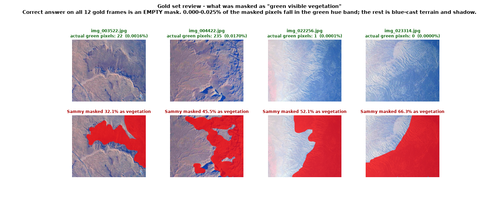

# Gold Set Review — Sammy

> # 🛑 CORRECTION — Section 1 (masks) is WITHDRAWN
>
> Section 1 measured greenness on the **raw** frames, which was the wrong test.
> After correcting the blue/violet colour cast against properly balanced USGS
> NAIP imagery, these frames do contain resolvable green vegetation, and the
> claim that "the correct mask on all 12 gold frames is empty" is **wrong**.
>
> See the correction banner on
> [CHECKPOINT5_REVIEW.md](CHECKPOINT5_REVIEW.md) for the measurements.
>
> **Sammy: do not redo the masks yet**, and do not treat the three frames you
> left empty as the "correct" ones. The mask task restarts on colour-corrected
> frames with a rewritten rule A-1.
>
> **Section 2 still stands, and it is the more important finding** — 38 of 72
> presence answers being `uncertain` leaves the gold set unable to score
> annotators on road, building or field, and that is independent of the colour
> cast. The exposure finding in Section 4 also stands. The `forest` calls in
> Section 3 are on hold with the masks; the `building` and `water` calls stand.

> ### ⚠️ Read this before the midpoint check
>
> This page contains the reference answers for the 12 qualification images, and
> those same 12 are reused for the mid-production drift check (manual rule
> **Q-3**). The lead has decided to keep the same 12 rather than re-draw them, on
> the basis that the team will not consult this page before the midpoint.
>
> **A1–A4: do not read Section 3 or 4 of this page before completing your
> midpoint projects.** Sections 1 and 2 are safe to read at any time — they are
> about masks and about how gold sets work, not about the answers.
>
> **For the paper:** the midpoint check is now honour-based rather than blind, so
> it should be reported as a consistency check, not as an independent drift
> measurement. If a blind drift number is needed later, gold-label 12 fresh
> frames from the production pool and repoint the midpoint task file.

**Status: the gold set needs to be redone.** Not because of carelessness — the
annotation manual did not describe this footage correctly, and three of the four
production annotators independently made the same mask mistake. But the gold set
is the reference every other person is scored against, so it has to be fixed
before anything else in the project can move.

The good news: your file handling was flawless. All 12 images completed in all
three projects, exports consistent, PNG archive matching the mask JSON exactly,
naming correct. That part needs no attention at all.

---

## 1. The vegetation masks

The camera has a heavy blue/violet colour cast. Hazy plateau, shadowed canyon
walls, and dissected badlands all read as dark blue-grey, and at a glance that
looks like it could be dark vegetation. It is not.

Measuring against rule **A-1**'s definition of green (hue 65–170°, saturation ≥ 0.12):

| Frame | You masked | Green pixels in the whole frame | Of your masked pixels, share that are green |
|---|---:|---:|---:|
| `img_003522` | 32.1% | 22 | 0.000% |
| `img_004422` | 45.5% | 235 | 0.025% |
| `img_005564` | 15.9% | 0 | 0.000% |
| `img_006404` | 20.0% | 26 | 0.005% |
| `img_009710` | *empty* | 5 | — ✅ |
| `img_010196` | *empty* | 0 | — ✅ |
| `img_011104` | *empty* | 0 | — ✅ |
| `img_015013` | 18.7% | 1 | 0.000% |
| `img_018287` | 3.9% | 0 | 0.000% |
| `img_021152` | 3.0% | 0 | 0.000% |
| `img_022256` | 52.1% | 1 | 0.000% |
| `img_023314` | 66.3% | 0 | 0.000% |

On `img_023314` there are **zero** green pixels in the entire frame and 66.3% of
it is masked as vegetation. The median hue of everything you masked across all 12
frames is 215–249°, which is blue.

> **The correct mask on all 12 gold frames is empty.**

The three you left empty — `img_009710`, `img_010196`, `img_011104` — are the
three you got right.

One extra thing to watch: on `img_004422` the mask crosses the Lake Powell
shoreline and covers open water. **A-8** excludes water from the mask with no
exceptions, independent of the colour-cast issue.

New rules **A-11** and **A-12** in the team's checkpoint review cover this. A-12
is the one that matters most for you: an empty mask is a complete, valid answer.
Most frames on this flight have no vegetation at all, and the export archive
being nearly empty is correct, not a failed export.

---

## 2. The bigger problem: `uncertain` in a reference set

This is more consequential than the masks, and it is easy to miss.

You used `uncertain` on **38 of 72** presence answers — 53% of the gold set.

| Feature | yes | no | uncertain | Frames that can actually score an annotator |
|---|---:|---:|---:|---|
| water | 2 | 8 | 2 | 10 / 12 |
| road | 1 | 1 | **10** | **2 / 12** |
| building | 0 | 2 | **10** | **2 / 12** |
| forest | 3 | 2 | 7 | 5 / 12 |
| snow | 0 | 12 | 0 | 12 / 12 |
| field | 3 | 0 | **9** | **3 / 12** |

For an ordinary annotator, `uncertain` is the correct and honest answer when
evidence falls below the rule's minimum — that is exactly what **B-0** and **G-3**
are for, and nobody should stop using it.

**A gold set is different.** Gold is the answer key. When the key says
`uncertain`, an annotator who answers `yes`, one who answers `no`, and one who
answers `uncertain` all match it equally well, so the item measures nothing. With
road, building, and field, the current gold set can score annotators on 2, 2, and
3 frames out of 12 respectively. That is not enough to compute a meaningful
kappa.

**What to do instead when you are torn:** commit to the answer the rule's
minimum-evidence test produces, then write the frame and your reasoning in the
decision log. That way the item is still scoreable, and if the group later
disagrees, the log tells us exactly which items to revisit. Reserve `uncertain`
in gold for cases where the image genuinely cannot support any answer — it should
be rare, not the majority.

---

## 3. Specific calls to revisit

These are the ones I could verify directly from the imagery.

**`img_003522` — building should be `yes`.** You marked `no`. The lower-right of
this frame contains an industrial facility: large rectangular pads with straight
edges and right angles, and a lined turquoise pond. **B-3** is satisfied several
times over. This is the most clear-cut structure anywhere in the gold set, so it
matters that the key gets it right.

**`img_004422` — water should be `yes`.** You marked `no`. The lower half of this
frame contains large smooth lobes of Lake Powell with clean shorelines, filling
basins. Under **B-1** this is unambiguous, and the minimum is only ~20 px.

**`img_021152`, `img_022256`, `img_023314` — forest should be `no`.** You marked
`yes` on all three. These are dissected badlands under heavy blue haze at 23 km
altitude. There is no tree canopy; the frames contain 0, 1, and 0 green pixels
respectively. **B-4** needs continuous canopy larger than a grid cell. This is the
same colour-cast confusion as the masks, showing up in the presence flags.

**`img_004422`, `img_006404`, `img_018287` — field marked `yes`.** Worth
re-checking against new rule **B-10**: `field = yes` needs visible agricultural
surface — crop colour, tillage texture, or a centre-pivot circle. Terrain enclosed
by tracks does not qualify.

---

## 4. Exposure

`exposure = over` on 6 of 12 frames: `img_004422`, `img_005564`, `img_006404`,
`img_011104`, `img_022256`, `img_023314`.

The manual's threshold for `over` is clipped highlights on **more than 10%** of
the frame. Measured across your 12 gold frames, the worst clips **0.19%**. None
of them is over-exposed. Correct answer is `ok` on all 12.

These frames look bright because of the haze, not because highlights are blown.
Task E thresholds are numeric and should be applied as hard rules rather than
impressions — if you cannot see large solid-white areas with no detail, it is not
`over`.

On clarity, you called `img_018287` `moderate` and `img_010196` `clear`. Those two
frames have nearly identical measured contrast (0.051 and 0.053, the two lowest in
the gold set). `moderate` was the better call; apply it to both. New rule **E-2**
gives the anchor.

---

## 5. What to redo

1. Read the team checkpoint review first, especially the new rules
   A-11, A-12, B-9, B-10, E-2, E-3:
   [CHECKPOINT5_REVIEW.md](CHECKPOINT5_REVIEW.md)
2. Redo all 12 **mask** tasks. Expect all 12 to end up empty.
3. Redo all 12 **presence** tasks, replacing `uncertain` with a committed answer
   wherever the minimum-evidence test can decide it, and logging anything you
   are forced to leave open.
4. Redo all 12 **quality** tasks with `exposure = ok` throughout and clarity
   judged by rule E-2.
5. Re-export and re-upload the four files to `Sammy_gold_final/`, keeping the
   same filenames.

Do not look at any A1–A4 submission while redoing this. The gold set has to stay
independent.

---

## A note

Nothing here is a reflection on your care or effort — the three empty masks show
you were applying the rule as written, and the manual simply never said what to do
when an entire flight is shifted toward blue. The `uncertain` issue is a
subtlety about what a reference set is for that the guide never explained either.
Both gaps are now written down as numbered rules so the next pass is
unambiguous.

---

See also: [CHECKPOINT5_REVIEW.md](CHECKPOINT5_REVIEW.md) — the same review for A1-A4,
with the answer key for the five calibration frames and the new numbered rules.
